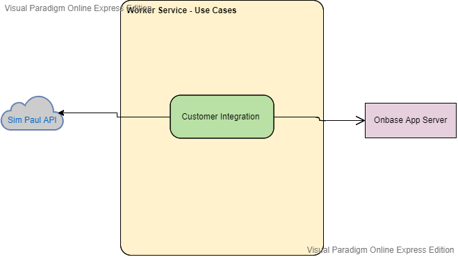

# Sim Paul: Onbase Integration:
[](https://ci.appveyor.com/project/ivanpaulovich/clean-architecture-manga)<a href="https://www.nuget.org/packages/Paulovich.Caju/" rel="Paulovich.Caju"> 

Implementation of the **Sim Paul Onbase Integraions**. Use cases as central organizing structure, decoupled from frameworks and technology details. Built with small components that are developed and tested in isolation.

## Index of Architecture

* [Use Cases](#use-cases)
* [Flow of Control](#register-flow-of-control)
  * [Customer Integration](#customer-flow-of-control)
* [Architecture Styles](#architecture-styles)
  * [Hexagonal Architecture Style](#ports-and-adapters-architecture-style)
    * [Ports](#ports)
    * [Adapters](#adapters)
    * [The Left Side](#the-left-side)
    * [The Right Side](#the-right-side)
  * [Onion Architecture Style](#onion-architecture-style)
  * [Clean Architecture Style](#clean-architecture-style)
* [Design Patterns](#design-patterns)
  * [Presenter](#presenter)
    * [Standard Output](#standard-output)
    * [Error Output](#error-output)
    * [Alternative Output](#alternative-output)
  * [Unit of Work](#unit-of-work)
  * [First-Class Collections](#first-class-collections)
  * [Factory](#factory)
* [Domain-Driven Design Patterns](#domain-driven-design-patterns)
  * [Value Object](#value-object)
  * [Entity](#entity)
  * [Aggregate Root](#aggregate-root)
  * [Repository](#repository)
  * [Use Case](#use-case)
* [Separation of Concerns](#separation-of-concerns)
  * [Domain](#domain)
  * [Application](#application)
  * [Infrastructure](#infrastructure)
  * [User Interface](#user-interface)
* [Encapsulation](#encapsulation)
* [Test-Driven Development TDD](#test-driven-development-tdd)
  * [Fakes](#fakes)
* [SOLID](#solid)
  * [Single Responsibility Principle](#single-responsibility-principle)
  * [Open-Closed Principle](#open-closed-principle)
  * [Liskov Substitution Principle](#liskov-substitution-principle)
  * [Interface Segregation Principle](#interface-segregation-principle)
  * [Dependency Inversion Principle](#dependency-inversion-principle)
* [Environment Configurations](#environment-configurations)
* [DevOps](#devops)
  * [Running the Application Locally](#running-the-application-locally)
  * [Running the Tests Locally](#running-the-tests-locally)
  * [Continuous Integration & Continuous Deployment](#continuous-integration-continuous-deployment)
  
## Use Cases

> Use Cases are delivery independent, they show the intent of a system.
> 
> Use Cases are algorithms which interpret the input to generate the output data.

Application architecture is about usage, a good architecture screams the business use cases to the developer and framework concerns are implementation details. On **Sim Paul** integration the user can `Integrate to Onbase` an customer.

<p align="center">
  
</p>

Following the list of Use Cases:

| Use Case             | Description                                                           |
|----------------------|-----------------------------------------------------------------------|
| CustomerIntegration             | Integrate customer from SimPaul registration API to Onbase App Server by Unit API.       |

## Flow of Control

The flow of control begins in the worker service, moves through the use case, and then winds up executing in the presenter.

### Customer Integration Flow of Control

1. The main `WorkerService` is executed and an worker `CustomerWorker` is invoked.
2. The action creates an `RegisterInput` message and the `Register` use case is executed.
3. The `Register` use case creates a `Customer` and an `Account`. Repositories are called, the `RegisterOutput` message is built and sent to the `RegisterPresenter`.
4. The `RegisterPresenter` builds the HTTP Response message.
5. The `CustomersController` asks the presenter the current response.


## Architecture Styles

Manga uses ideas from popular architectural styles. They Ports and Adapters are the simplest one followed by the others, they complement each other and aim a software made by use cases decoupled from technology implementation details.

### Hexagonal Architecture Style

The general idea behind Hexagonal architecture style is that the dependencies (Adapters) required by the software to run are used behind an interface (Port).  

The software is divided into **Application** and **Infrastructure** in which the adapters are interchangeable components developed and tested in isolation. The Application is loosely coupled to the Adapters and their implementation details.

#### Ports

Interfaces like `ICustomerRepository` and `ICustomerOnbaseService` are ports required by the application.

#### Adapters

The interface implementations, they are specific to a technology and bring external capabilities. For instance the `CustomerRepository` inside the `ApiDataAccess` folder provides capabilities to consume Sim Paul Customer API.


#### The Left Side

Primary Actors are usually the user interface or the Test Suit.

#### The Right Side

The Secondary Actors are usually Databases, Cloud Services or other systems.

### Onion Architecture Style

Very similar to Ports and Adapters, I would add that data objects cross boundaries as simple data structures. For instance, when the controller execute an use case it passes and immutable Input message. When the use cases calls an Presenter it gives a Output message (Data Transfer Objects if you like).

### Clean Architecture Style

An application architecture implementation guided by tests cases.

## Design Patterns

The following Design Patterns will help you continue implementing use cases in a consistent way.

### Presenter

Presenters are called by te application Use Cases and build the Response objects.

```c#
public sealed class RegisterPresenter : IOutputPort
{
    public IActionResult ViewModel { get; private set; }

    public void Error(string message)
    {
        var problemDetails = new ProblemDetails()
        {
            Title = "An error occurred",
            Detail = message
        };

        ViewModel = new BadRequestObjectResult(problemDetails);
    }

    public void Standard(RegisterOutput output)
    {
        /// long object creation omitted

        ViewModel = new CreatedAtRouteResult("GetCustomer",
            new
            {
                customerId = model.CustomerId
            },
            model);
    }
}
```

It is important to understand that from the Application perspective the use cases see an OutputPort with custom methods to call dependent on the message, and from the Web Api perspective the Controller only see the ViewModel property.

#### Standard Output

The output port for the use case regular behavior.

#### Error Output

Called when an blocking errors happens.

#### Alternative Output

Called when an blocking errors happens.

### Component

## Domain-Driven Design Patterns

The following patterns are known to describe business solutions.

### Value Object

Describe the tiny domain business rules. Objects that are unique by the has of their properties. Are immutable.

### Entity

Mutable objects unique identified by their IDs.

```c#
public class Customer 
{
    /// <summary>
    /// Customer Id
    /// </summary>
    public int Id { get; set; }

    /// <summary>
    /// Customer name
    /// </summary>
    public string Name { get; set; }

    /// <summary>
    /// Customer document
    /// </summary>
    public string Document { get; set; }

    /// <summary>
    /// Customer e-mail
    /// </summary>
    public string Email { get; set; }
    
    /// <summary>
    /// Customer mother name
    /// </summary>
    public string Mother { get; set; }

    /// <summary>
    /// Customer photo represented by base64 data
    /// </summary>
    public string Photo { get; set; }
}
```

### Aggregate Root

Similar to Entities with the addition that Aggregate Root are responsible to keep the tree of objects consistent.

### Repository

```c#
public class CustomerRepository
{
    private HttpClient _client;
    private CustomerApiSettings _customerApiSettings;

    /// <summary>
    /// CustomerRepository constructor
    /// </summary>
    /// <param name="client"></param>
    /// <param name="customerApiSettings"></param>
    public CustomerRepository(HttpClient client, CustomerApiSettings customerApiSettings)
    {
        _client = client;
        _customerApiSettings = customerApiSettings;

        _client = client;
        _client.BaseAddress = new Uri(customerApiSettings.BaseUrl);
        _client.DefaultRequestHeaders.Accept.Clear();
        _client.DefaultRequestHeaders.Accept.Add(new MediaTypeWithQualityHeaderValue("application/json"));

    }

    /// <summary>
    /// Get diverged registrations from SimPaul Customer API
    /// </summary>
    /// <returns></returns>
    public IList<Customer> DivergedRegistrations()
    {
        var requestMessage = new HttpRequestMessage(HttpMethod.Get, _customerApiSettings.DivergedResource);

        var responseMessage = _client.SendAsync(requestMessage)
                .GetAwaiter()
                .GetResult();          

        responseMessage.EnsureSuccessStatusCode();

        string responseContent = responseMessage.Content
                .ReadAsStringAsync()
                .GetAwaiter()
                .GetResult();
        
        var divergedRegistrations = JsonConvert.DeserializeObject<List<Customer>>(responseContent);
        return divergedRegistrations;
    }
}
```

### Use Case

```c#
public class CustomerIntegrationUseCase : ICustomerIntegrationUseCase
{
    private readonly ICustomerRepository _customerRepository;
    private readonly ICustomerOnbaseService _customerOnbaseService;
    private readonly ILogger<CustomerIntegrationUseCase> _logger;

    /// <summary>
    /// Constructor for CustomerIntegrationUseCase
    /// </summary>
    /// <param name="customerRepository"></param>
    /// <param name="customerOnbaseService"></param>
    public CustomerIntegrationUseCase(ICustomerRepository customerRepository, ICustomerOnbaseService customerOnbaseService, ILogger<CustomerIntegrationUseCase> logger)
    {
        _customerRepository = customerRepository;
        _customerOnbaseService = customerOnbaseService;
        _logger = logger;
    }

    
    /// <summary>
    /// Method Handle
    /// </summary>
    /// <returns>CustomerIntegrationOutput</returns>
    public CustomerIntegrationOutput Handle()
    {
        try
        {
            var divergedRegistrations = _customerRepository.DivergedRegistrations();                

            foreach (var customer in divergedRegistrations)
            {
                _customerOnbaseService.Handle(customer);
            }

            return new CustomerIntegrationOutput(divergedRegistrations.Count);
        }
        catch (Exception ex)
        {
            this._logger.LogError(ex, "Error on executing Customer Integration Use Case. See exception for more details.");
            throw ex;
        }
    }
}
```

## Separation of Concerns

<p align="center">
  
</p>

### Domain

The package that contains the `High Level Modules` which describe the Domain via Aggregate Roots, Entities and Value Objects. By design this project is `Highly Abstract` and `Stable`, in other terms this package contains a considerable amount of interfaces and should not depend on external libraries and frameworks. Ideally it should be loosely coupled even to the .NET Framework.

### Application

A project that contains the Application Use Cases which orchestrate the high level business rules. By design the orchestration will depend on abstractions of external services (eg. Repositories). The package exposes Boundaries Interfaces (in other terms Contracts or `Ports`) which are used by the user interface.

### Infrastructure

The infrastructure layer is responsible to implement the `Adapters` to the `Secondary Actors`. For instance an SQL Server Database is a secondary actor which is affected by the application use cases, all the implementation and dependencies required to consume the SQL Server is created on infrastructure. By design the infrastructure depends on application layer.

### User Interface

The system entry point responsible to render an interface to interact with the User. Made with Controllers which receive HTTP Requests and Presenters which converts the application outputs into ViewModels that are rendered as HTTP Responses.

## Encapsulation

> Given a class, the sum of its members complexity should be less that the sum of its parts in isolation.

> Classes that are similar to a bag of data leaks unnecessary complexity. Consider reducing the complexity with something like:

## Test-Driven Development (TDD)

> You are not allowed to write any production code unless it is to make a failing unit test pass.
>
> You are not allowed to write any more of a unit test than is sufficient to fail; and compilation failures are failures.
>
> You are not allowed to write any more production code than is sufficient to pass the one failing unit test.

http://butunclebob.com/ArticleS.UncleBob.TheThreeRulesOfTdd

### Fakes

> Fake it till you make it

## SOLID

### Single Responsibility Principle

> A class should have one, and only one, reason to change.

### Open-Closed Principle

> You should be able to extend a classes behavior, without modifying it.

### Liskov Substitution Principle

> Derived classes must be substitutable for their base classes.

### Interface Segregation Principle

> Make fine grained interfaces that are client specific.

### Dependency Inversion Principle

> Depend on abstractions, not on concretions.

## Environment Configurations

To run service configure these settings :


```json
{
    "OnbaseSettings": {
        "FormIntegrationID": 0,
        "AppServerURL": "",
        "Username": "",
        "Password": "",
        "DataSource": "",
        "CustomerDocumentType": "CD - RG",
        "CustomerDocumentFileType": "Image File Format"
    },
    "CustomerApiSettings": {
        "BaseUrl": "",
        "DivergedResource" :  ""
    }
}
```

## DevOps

### Running the Application Locally

Sim Paul is not a cross-platform application, you can run it only from Windows. To develop new features, you may use Visual Studio or Visual Studio Code :heart:.

The single requirement is to install the latest .NET Code SDK.

* [.NET Core SDK 3.0](https://www.microsoft.com/net/download/dotnet-core/3.0)

### Running the Tests Locally

Run the following command at the root folder:

```sh
dotnet test
```


## Related Content and Projects

| Video                                 | Date         |
|---------------------------------------|--------------|
| [Hexagonal and Clean Architecture styles. Same or Different?](https://www.youtube.com/watch?v=FNQbyZu-NAo)| Sep 16, 2019  |
| [Clean Architecture Essentials](https://www.youtube.com/watch?v=NjPjCxTIf4M)| Sep 13, 2019  |
| [Shinning Frameworks and DDD?!](https://www.youtube.com/watch?v=OmxBqmmhoHg)| Sep 12, 2019  |
| [Clean Architecture: The User Interface is a detail](https://www.youtube.com/watch?v=lWH_ZDu2zKQ)| Sep 11, 2019  |
| [TDD and Hexagonal Architecture: Clean Tests](https://www.youtube.com/watch?v=j6_XPsqjrhE)| Sep 10, 2019  |
| [Designing and Testing Input Validation with .NET Core: The Clean Architecture way](https://www.youtube.com/watch?v=hyW4d5OcExw)| Sep 9, 2019  |
| [Clean Architecture Manga](https://www.youtube.com/watch?v=ivAkdJmSqLQ)              | Aug 6, 2019  |
| [TDD and TDD with .NET Core and VSCode](https://www.youtube.com/watch?v=ORe0r4bpfac&t=360s) | Nov 3, 2018  |
| [Introduction to Clean Architecture](https://www.youtube.com/watch?v=6SeoWIIK1NU&t=50s)    | Oct 31, 2018 |
